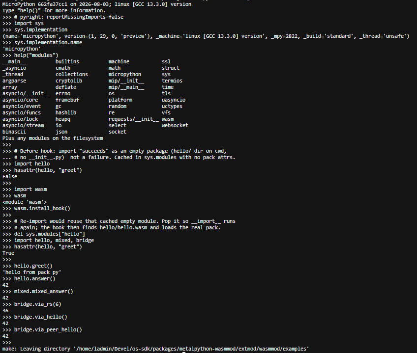
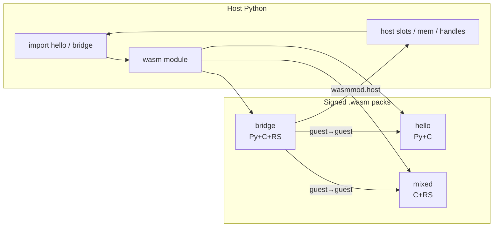
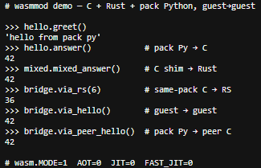
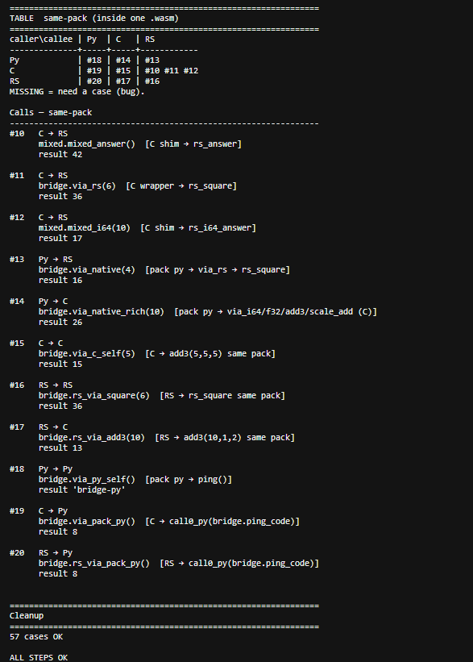
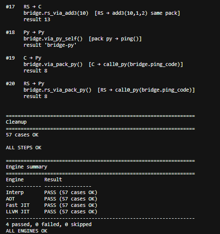

# wasmmod

**Signed WASM packs for Python.**  
One `.wasm` file can ship **C + Rust + embedded Python**, talk to peer packs, and call back into the host — loaded by [WAMR](https://github.com/bytecodealliance/wasm-micro-runtime) through a small MicroPython `wasm` module (CPython path planned).

Drop-in submodule: `extmod/wasmmod` → `#include "extmod/wasmmod/..."`.

<p align="center">
  
</p>

---

## Why it shows off

| Superpower | What you get |
|------------|----------------|
| **Multi-impl packs** | C, Rust, and pack-local Python in one artifact |
| **Guest → guest** | `bridge` imports `hello` / `mixed` without host glue per call |
| **Guest → host → Py** | `wasmmod.host` slots, buffers, mem cookies, object handles |
| **Engine matrix** | Interp · AOT · Fast JIT · LLVM JIT — same packs |

```
caller\callee | Py  | C   | RS
--------------+-----+-----+----
Py            |  ✓  |  ✓  |  ✓
C             |  ✓  |  ✓  |  ✓
RS            |  ✓  |  ✓  |  ✓
+ guest→guest, guest→host, rich i64/f32/f64 …
```

`make -C examples test-engines` → **57 cases × 4 engines**.

---

## Taste in three languages

**Pack Python** calls a native export in the same `.wasm`:

```python
# hello/src/__init__.py
def greet():
    return "hello from pack py"

def answer():
    return hello()   # → C export in this pack
```

**C guest** imports peers + host with one macro:

```c
#include "../../guest.h"

MP_WASM_IMPORT("hello", int, hello, void);
MP_WASM_IMPORT("mixed", int, mixed_answer, void);
MP_WASM_IMPORT("wasmmod.host", int, call_i32, int slot, int arg);

int via_rs(int x)   { return rs_square(x); }   /* same-pack Rust */
int via_hello(void) { return hello(); }        /* peer pack */
int via_host(int x) { return call_i32(0, x); } /* host slot */
```

**Rust** freestanding export (linked into `mixed` / `bridge`):

```rust
#![no_std]

#[no_mangle]
pub extern "C" fn rs_answer() -> i32 { 7 }

#[no_mangle]
pub extern "C" fn rs_i64_answer(x: i64) -> i64 { x + 7 }
```

**Host** — real unix MicroPython REPL (`wasm` is a built-in; see `help('modules')`):

```text
MicroPython … on 2026-08-03; linux [GCC …] version
Type "help()" for more information.
>>> import sys
>>> sys.implementation.name
'micropython'
>>> help("modules")
…  requests/__init__ wasm
…  select            websocket
…  socket
Plus any modules on the filesystem
>>> import wasm
>>> wasm.path.append("packs")
>>> wasm.install_hook()
>>> import hello, mixed, bridge    # packs/hello.wasm etc.
>>> hello.greet()
'hello from pack py'
>>> bridge.via_rs(6)
36
```

**FQN → file:** `import a.b` searches `wasm.path` then `sys.path` (dots → `/`):

1. `a/b/__init__.wasm` (package)
2. `a/b.wasm` (module)

Examples use `packs/<name>.wasm` on `wasm.path`. Nested names inside a pack (`hello.util`) come from embedded pack-Python — not a second file. Explicit path: `wasm.load_pack("packs/foo.wasm", "foo")`.

```bash
make -C examples demo    # real REPL: micropython -i < demo_readme.py
make -C examples repl    # interactive — type it yourself
```

---

## Layout

```
wasmmod/
├── pack.*  runtime.*  forward.*  verify.*   portable core
├── fetch.*  wasmmod.c  finder.*  host.*     MicroPython host
├── ports/micropython/                       make / cmake / mpconfig
├── tools/wasm_{pack,sign}.py                host-agnostic CLIs
├── examples/                                sources + packs/ + call matrix
│   └── packs/                               built <name>.wasm artifacts
├── screenshots/                             README eye-catchers
├── docs/PACK.md                             section format
└── third_party/wamr                         WAMR (Apache-2.0)
```

Pack sections are named `wasmmod.pack` / `wasmmod.imports` / `wasmmod.host` / `wasmmod.sig` — see [docs/PACK.md](docs/PACK.md).



---

## MicroPython integration

```bash
git submodule add https://github.com/pymergetic/wasmmod.git extmod/wasmmod
git submodule update --init --recursive extmod/wasmmod
```

Host tree only needs thin includes (no `py/mpconfig.h` edits):

```make
# extmod/extmod.mk
ifeq ($(MICROPY_PY_WASM),1)
include $(TOP)/extmod/wasmmod/ports/micropython/micropython.mk
endif
```

```cmake
# extmod/extmod.cmake
if(MICROPY_PY_WASM)
    include(${MICROPY_DIR}/extmod/wasmmod/ports/micropython/micropython.cmake)
endif()
```

Enable with `make MICROPY_PY_WASM=1` (optional `MICROPY_PY_WASM_{AOT,JIT,FAST_JIT,MATRIX}`).  
Optional C defaults: `#include "extmod/wasmmod/ports/micropython/mpconfig_wasm.h"`.

Optional host trampolines (metalpython): `tools/wasm_pack.py` / `tools/wasm_sign.py` → `extmod/wasmmod/tools/…`.

---

## Build & test

From the **host** MicroPython / metalpython tree:

```bash
make -C ports/unix submodules
make -C mpy-cross BUILD=build -j"$(nproc)"   # pack freeze (.mpy)

make -C extmod/wasmmod/examples test           # interp matrix
make -C extmod/wasmmod/examples test-engines   # all engines
make -C extmod/wasmmod/examples demo           # real micropython -i session
make -C extmod/wasmmod/examples repl           # interactive unix REPL
```

```text
Engine summary
================================================================
Engine       Result
------------ ----------------
Interp       PASS (57 cases OK)
AOT          PASS (57 cases OK)
Fast JIT     PASS (57 cases OK)
LLVM JIT     PASS (57 cases OK)
----------------------------------------------------------------
4 passed, 0 failed, 0 skipped
ALL ENGINES OK
```

Details: [examples/README.md](examples/README.md) · pack format: [docs/PACK.md](docs/PACK.md).

---

## Preview

More shots (click through for full size):

<p align="center">
  <a href="screenshots/pack-calls.png"></a>
  &nbsp;
  <a href="screenshots/matrix-table.png"></a>
  &nbsp;
  <a href="screenshots/engine-summary.png"></a>
</p>

| | |
|---|---|
| [`pack-calls.png`](screenshots/pack-calls.png) | Cross-lang pack calls |
| [`matrix-table.png`](screenshots/matrix-table.png) | Same-pack Py ↔ C ↔ RS matrix |
| [`engine-summary.png`](screenshots/engine-summary.png) | Interp · AOT · Fast JIT · LLVM JIT |
| [`repl-demo.png`](screenshots/repl-demo.png) | Full MicroPython REPL (hero above) |

---

## License

MIT — Copyright (c) 2026 Rouven Raudzus \<raudzus@pymergetic.com\>  
Nested `third_party/wamr` is **Apache-2.0** (Bytecode Alliance); see [LICENSE](LICENSE).
