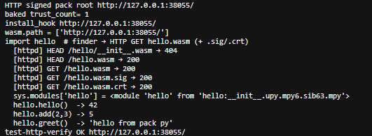
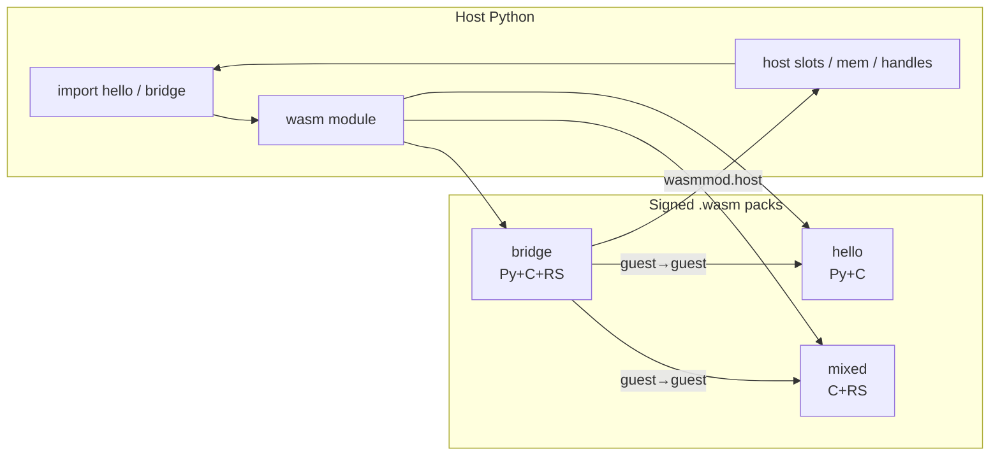

# wasmmod

**v0.1.4-alpha** — signed packs for Python (`.wasm` / `.aot` / `.elf`).

> **Experimental.** This is a pre-release (`-alpha`). APIs, pack layout, verify/HTTP
> surfaces, and build flags may change without a stable compatibility promise.
> Default-off on purpose (`MICROPY_PY_WASM=0`); treat enablement as an experiment
> until a non-alpha release. Engine matrix and demos are exercised often, but the
> surface is still moving fast.

One pack file can ship **C + Rust + embedded Python**, talk to peer packs, and call back into the host. **Wasm/AOT** run on [WAMR](https://github.com/bytecodealliance/wasm-micro-runtime); **ELF** (`.elf` / `.<arch>.elf`, ET_REL) uses an in-tree reloc loader (no `dlopen`). Same MicroPython `wasm` module either way (CPython path planned). Opt-in only (`MICROPY_PY_WASM=0` by default); host trees stay unchanged unless they include the submodule and turn the flag on.

Drop-in submodule: `extmod/wasmmod` → `#include "extmod/wasmmod/..."`.

<p align="center">
  
</p>

---

## Why it shows off

| Superpower | What you get |
|------------|----------------|
| **Multi-impl packs** | C, Rust, and pack-local Python in one artifact |
| **Containers** | `.wasm` · `.aotN` · `.elf` / `.<arch>.elf` (same MPWI/sign/finder) |
| **Guest → guest** | `bridge` / ELF `client` import peers without host glue per call |
| **Guest → host → Py** | `wasmmod.host` slots, buffers, mem cookies, object handles |
| **Engine matrix** | Interp · AOT · Fast JIT · LLVM JIT — same Wasm packs; ELF skips WAMR |

```
caller\callee | Py  | C   | RS
--------------+-----+-----+----
Py            |  ✓  |  ✓  |  ✓
C             |  ✓  |  ✓  |  ✓
RS            |  ✓  |  ✓  |  ✓
+ guest→guest, guest→host, rich i64/f32/f64 …
```

`make -C examples test-engines` → **57 cases × 4 engines**.

---

## Taste in three languages

**Pack Python** calls a native export in the same `.wasm`:

```python
# hello/src/__init__.py
def greet():
    return "hello from pack py"

def answer():
    return hello()   # → C export in this pack
```

**C guest** imports peers + host with one macro:

```c
#include "../../guest.h"

MP_WASM_IMPORT("hello", int, hello, void);
MP_WASM_IMPORT("mixed", int, mixed_answer, void);
MP_WASM_IMPORT("wasmmod.host", int, call_i32, int slot, int arg);

int via_rs(int x)   { return rs_square(x); }   /* same-pack Rust */
int via_hello(void) { return hello(); }        /* peer pack */
int via_host(int x) { return call_i32(0, x); } /* host slot */
```

**Rust** freestanding export (linked into `mixed` / `bridge`):

```rust
#![no_std]

#[no_mangle]
pub extern "C" fn rs_answer() -> i32 { 7 }

#[no_mangle]
pub extern "C" fn rs_i64_answer(x: i64) -> i64 { x + 7 }
```

**Host** — real unix MicroPython REPL (`wasm` is a built-in; see `help('modules')`):

```text
MicroPython … on 2026-08-03; linux [GCC …] version
Type "help()" for more information.
>>> import sys
>>> sys.implementation.name
'micropython'
>>> help("modules")
…  requests/__init__ wasm
…  select            websocket
…  socket
Plus any modules on the filesystem
>>> import wasm
>>> wasm.path.append("packs")
>>> wasm.install_hook()
>>> import hello, mixed, bridge    # packs/hello.wasm etc.
>>> hello.greet()
'hello from pack py'
>>> bridge.via_rs(6)
36
```

HTTP roots use the same static layout (native C GET). With a baked root CA, signed packs verify over the wire:

```text
make -C examples test-signed   # → test-http-verify OK
```

<p align="center">
  
</p>

Example without verify: `wasm.verify(False); wasm.install_hook("http://host/packs/")` then `import hello`.
See also `make -C examples test-http`.

**FQN → file:** `import a.b.c` searches `wasm.path` then `sys.path`. A pack can sit at any depth; if only the leaf file exists, missing parents are thin namespace packages (PEP 420-ish) so `a.b.c` stays attribute-reachable. VFS pack roots are scanned so `import a` / `a.b` work when children exist (flat `a.b.c.wasm` or tree `a/b/…`).

Path form (dots → `/`): `a/b/c/__init__.wasm` · `a/b/c.wasm`  
Flat form (e.g. under `packs/`): `a.b.c.wasm`

**Containers / preference:** `MICROPY_WASM_CONTAINERS` (unix default `elf,aot,wasm`) picks
`*.elf` / `*.<arch>.elf` / AOT / Wasm (+ `.zlib`). Nested names *inside* one pack
(`hello.util`) still come from embedded pack-Python when no leaf file exists.
Explicit: `wasm.load_pack("packs/foo.wasm", "foo")` or `…/foo.elf`.
Browser builds stay wasm-only (`MICROPY_PY_WASM_ELF=0`).

```bash
make -C examples demo    # real REPL: micropython -i < demo_readme.py
make -C examples repl    # interactive — type it yourself
```

---

## Layout

```
wasmmod/
├── pack.*  runtime.*  forward.*  verify.*   portable core
├── fetch.*  io.h  wasmmod.c  finder.*  host.*  MicroPython host
├── ports/                                   make / cmake / mpconfig / PORT.md
│   └── micropython/webassembly/             browser: js.fetch I/O + Emscripten WAMR
├── tools/wasmmod.py                         unified CLI (pack / pack-elf / sign / …)
├── examples/                                sources + packs/ + call matrix
│   └── packs/                               built <name>.{wasm,elf,aotN} artifacts
├── screenshots/                             README eye-catchers
├── docs/PACK.md                             section format
├── BRANCHES.md                              MetalPython host branch layout
├── VERSION                                  → wasm.version (always when built)
└── third_party/wamr                         WAMR (Apache-2.0)
```

Pack sections are named `wasmmod.pack` / `wasmmod.imports` / `wasmmod.host` / `wasmmod.sig` — see [docs/PACK.md](docs/PACK.md). Host I/O replaceability (Metal async, browser `js.fetch`): [ports/PORT.md](ports/PORT.md).

CDN / channel publish (lead + `@version` pins, index schema, browser µPy shell): separate repo
[metal-cdn](https://github.com/pymergetic/metal-cdn).

One-shot release (pack → AOT → sign → zlib → upload):

```sh
pip install -r requirements-publish.txt
python3 tools/wasmmod.py publish examples/hello --version 0.1.0 \
  --key .keys/sign/leaf.key.pem --chain .keys/sign/chain.der \
  --cdn-url https://cdn.example/cdn --token "$METAL_CDN_TOKEN" --claim

# Also upload a prebuilt ELF twin (staged under -o; --arch inserts CDN infix):
python3 tools/wasmmod.py publish examples/hello --version 0.1.0 \
  --elf examples/packs/hello.elf --arch x86_64 \
  --key .keys/sign/leaf.key.pem --chain .keys/sign/chain.der \
  --cdn-url https://cdn.example/cdn --token "$METAL_CDN_TOKEN"
```

Remote index / lookup / download (pip-style):

```sh
python3 tools/wasmmod.py cdn list
python3 tools/wasmmod.py cdn search hello
python3 tools/wasmmod.py cdn show hello
python3 tools/wasmmod.py cdn get hello -o ./packs --unwrap
```

CI: [`.github/workflows/publish-pack.yml`](.github/workflows/publish-pack.yml).



---

## MicroPython integration

```bash
git submodule add https://github.com/pymergetic/wasmmod.git extmod/wasmmod
git submodule update --init --recursive extmod/wasmmod
```

Host tree only needs thin includes (no `py/mpconfig.h` edits):

```make
# extmod/extmod.mk
ifeq ($(MICROPY_PY_WASM),1)
include $(TOP)/extmod/wasmmod/ports/micropython/micropython.mk
endif
```

```cmake
# extmod/extmod.cmake
if(MICROPY_PY_WASM)
    include(${MICROPY_DIR}/extmod/wasmmod/ports/micropython/micropython.cmake)
endif()
```

Enable with `make MICROPY_PY_WASM=1` (optional `MICROPY_PY_WASM_{AOT,ELF,JIT,FAST_JIT,MATRIX}`,
`MICROPY_WASM_CONTAINERS=elf,aot,wasm`). Unix defaults ELF on when Wasm is on; browser forces wasm-only.
Optional C defaults: `#include "extmod/wasmmod/ports/micropython/mpconfig_wasm.h"`.  
`wasm.version` is always the package release string from [`VERSION`](VERSION) (e.g. `'0.1.4-alpha'`).  
`wasm.wamr_version()` returns the linked WAMR `major.minor.patch` string.  
`wasm.AOT_VERSION` is the AOT file-format N used in CDN artifact names.  
Guests see the same loader surface as WAMR imports on module **`wasmmod`**: `version`, `mode`, `verify`, `trust_count`, `call_i32` (dynamic pack export; peer of host `wasm.c_call` / `rs_call`). Callbacks/slots stay on **`wasmmod.host`**.

CDN loader without loading a pack:

```python
wasm.cdn("https://cdn.example/cdn")   # MetalCdnDriver; no pack fetch
wasm.install_hook()                   # import finder on; still no pack load
wasm.session_id("…")                  # optional correlation id (autoexec sets this)
# import hello                        # first HTTP / VFS pack load
names = wasm.catalog()                # GET …/index/lead → package name list
# wasm.publish("pkg", "0.1.0", data)  # NotImplemented until host request op
```

`wasm.load(path_or_bytes)` loads a raw `.wasm` module (not a metal pack). Prefer
`wasm.load_pack(...)` / `import` for CDN packs.

**Browser (Emscripten):** out-of-tree variant under
[`ports/micropython/webassembly/`](ports/micropython/webassembly/) — `js.fetch` I/O
(with optional Bearer + `X-Shell-Session-Id` when configured),
no pollution of vanilla `ports/webassembly/`. See that folder’s README for build +
sync into metal-cdn `static/repl/`.

Optional host trampoline (metalpython): `tools/wasmmod.py` → `extmod/wasmmod/tools/wasmmod.py`.  
MetalPython host branch layout (`wasmmod` PR track under product `master`): [BRANCHES.md](BRANCHES.md).

---

## Build & test

From the **host** MicroPython / metalpython tree:

```bash
make -C ports/unix submodules
make -C mpy-cross BUILD=build -j"$(nproc)"   # pack freeze (.mpy)

make -C extmod/wasmmod/examples test           # interp matrix
make -C extmod/wasmmod/examples test-engines   # all engines
make -C extmod/wasmmod/examples test-http      # static HTTP pack fetch
make -C extmod/wasmmod/examples test-verify    # ECDSA .sig+.crt + baked root CA
make -C extmod/wasmmod/examples test-signed    # PKI sign + VFS + HTTP verify
make -C extmod/wasmmod/examples demo           # real micropython -i session
make -C extmod/wasmmod/examples repl           # interactive unix REPL

# Browser µPy + wasmmod (needs emsdk on PATH):
source ~/emsdk/emsdk_env.sh
make -C extmod/wasmmod/ports/micropython/webassembly -j"$(nproc)"
# → ports/webassembly/build-wasmmod/micropython.{mjs,wasm}
```

```text
Engine summary
================================================================
Engine       Result
------------ ----------------
Interp       PASS (57 cases OK)
AOT          PASS (57 cases OK)
Fast JIT     PASS (57 cases OK)
LLVM JIT     PASS (57 cases OK)
----------------------------------------------------------------
4 passed, 0 failed, 0 skipped
ALL ENGINES OK
```

Details: [examples/README.md](examples/README.md) · pack format: [docs/PACK.md](docs/PACK.md) ·
browser port: [ports/micropython/webassembly/README.md](ports/micropython/webassembly/README.md) ·
CDN channels / shell: [metal-cdn](https://github.com/pymergetic/metal-cdn).

---

## Preview

More shots (click through for full size):

<p align="center">
  <a href="screenshots/pack-calls.png"></a>
  &nbsp;
  <a href="screenshots/matrix-table.png"></a>
  &nbsp;
  <a href="screenshots/engine-summary.png"></a>
</p>

| | |
|---|---|
| [`pack-calls.png`](screenshots/pack-calls.png) | Cross-lang pack calls |
| [`matrix-table.png`](screenshots/matrix-table.png) | Same-pack Py ↔ C ↔ RS matrix |
| [`engine-summary.png`](screenshots/engine-summary.png) | Interp · AOT · Fast JIT · LLVM JIT |
| [`repl-demo.png`](screenshots/repl-demo.png) | Full MicroPython REPL (hero above) |
| [`http-verify.png`](screenshots/http-verify.png) | Signed HTTP fetch + baked trust |

---

## License

MIT — Copyright (c) 2026 Rouven Raudzus \<raudzus@pymergetic.com\>  
Nested `third_party/wamr` is **Apache-2.0** (Bytecode Alliance); see [LICENSE](LICENSE).
