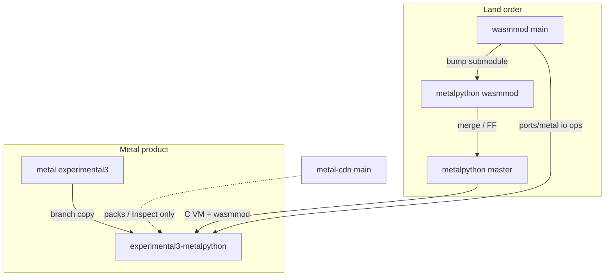

# Final integration plan — metal × metalpython × wasmmod

**Order (locked):** A wraps → B metalpython Metal prep → C integrate from `experimental3`.
**No automatic pushes.** Commit only when asked.

---

## Bindings lock (why `pm_*` exists)

C (`pm_upy_*` / `pm_wasmmod_*`) + Rust (`crates/pm` thin wraps) are the **shared host border** so:

- **metalpython** (C µPy + wasmmod) and
- **metal** (mainly Rust, hybrid core)

both talk the same gut-control / pack API without private `extmod/*.h` or forked call sites.

**May add to wasmmod** when Metal needs it — especially **GC policy, async park/resume, CPU runners, loop/step** — but every addition must stay **µPy compliant/compatible**:

| Do | Don't |
|----|--------|
| Sync µPy-facing APIs; Metal parks async *inside* io/ops hooks (`ports/PORT.md`) | Teach finder/load about Metal sockets or runners |
| Feature probes / DEAD-GC / scheduler-off that match stock build flags | Break unix `MICROPY_PY_WASM=1` or upstream-shaped `wasmmod` branch |
| Optional `ports/metal/` + replaceable `mp_wasm_io_ops_t` | Metal-only types in public `pm_*` that C hosts can't call |
| Thin `pm_*` that wrap real µPy entry points | Parallel fake asyncio/GC engines that diverge from upy semantics |

Clean **metalpython `wasmmod`** branch stays PR-shaped: port hooks yes, kernel bodies no.

---

## CDN nav lock (UI)

- **Natural tree only:** `pymergetic.wasmmod` lives under `pymergetic` → `wasmmod`, same as demos.
- **No** fake `Platform` group (that was Extrawurst — wrong).
- Host/kernel: **color** on the name + compact **computer / gear SVG** with **tooltip** (Inspect only; Play off).
- Play/Try still disabled for `role=host|kernel`.

---

## Repo / branch map (nothing in the wrong bin)

```text
os-sdk/packages/
├── wasmmod/              repo pymergetic/wasmmod     branch main
│                         pack engine + pm_* ABI + crates/pm + ports/
│
├── metalpython/          repo pymergetic/metalpython
│   ├── branch wasmmod    clean µPy + extmod/wasmmod submodule (upstream PR track)
│   ├── branch master     MUST keep wasmmod as ancestor; product extras land here
│   └── branch micropython-rust   optional Rust rewrite (NOT current master tip)
│
├── metalpython-wasmmod/  worktree of metalpython @ wasmmod
│
├── metal-cdn/            repo pymergetic/metal-cdn    branch main
│                         catalog UI / publish / Inspect (not the VM)
│
└── metal/                repo pymergetic/metal
    ├── branch experimental3   current product (Rust upy mirror + async)
    └── branch experimental3-metalpython   (to create) integration branch
```



| Bin | Allowed content | Forbidden |
|-----|-----------------|-----------|
| **wasmmod `main`** | `pm_*`, glue, `crates/pm`, pack/CDN client, `ports/metal` hooks | Metal kernel, reg, forge product |
| **metalpython `wasmmod`** | submodule bumps + thin host trampoline | Metal-private async/TLSF bodies |
| **metalpython `master`** | wasmmod tip + product extras (after ancestor merge) | Diverging submodule tip without bump on `wasmmod` first |
| **metal `experimental3*`** | OS: reg / py edge / wasm / mem / async | Rewriting wasmmod pack format in-tree |
| **metal-cdn** | UI, index, federation, Play policy | Hosting the µPy VM |

---

## Proposed module / file structure (after C)

### metal (integration branch) — keep edge, swap VM body

```text
packages/metal/src/pymergetic/metal/
├── reg/                          # KEEP — cross-lang bus
├── mem/ … async/ …               # KEEP — one TLSF, runners
├── wasm/                         # KEEP delivery OR thin → wasmmod load → reg
└── py/
    ├── __init__.rs               # KEEP pm_metal_py_* border
    ├── _loop.rs _shell.rs _bind.rs
    ├── _async_bridge.rs          # KEEP — py await = Metal async
    ├── _alloc.rs _gc_off.rs      # KEEP — Metal heap; GC dead
    ├── port/                     # KEEP/adapt HAL to metalpython
    └── upy/                      # REPLACE — retire Rust mirror
        └── (gone or shim only)

# New / linked (M1 default):
#   path/submodule → packages/metalpython (+ extmod/wasmmod)
#   calls pm_upy_* / pm_wasmmod_* (crates/pm or C)
```

### wasmmod — host ABI + Metal port

```text
extmod/wasmmod/                    # submodule of metalpython (sole checkout)
├── include/pm_{upy,wasmmod,guest}.h
├── glue/pm_{upy,wasmmod}/
├── crates/pm/src/{upy,wasmmod}/
├── ports/
│   ├── micropython/
│   └── metal/                     # freestanding WAMR + io_ops / register_upy
├── dev/
│   ├── tools/                     # submodule → wasmmod-tools
│   └── test/                      # submodule → wasmmod-test
├── docs/METAL_INTEGRATION.md
└── wasmmod.c
```

### metalpython — clean host track

```text
packages/metalpython/          # branch wasmmod
├── extmod/wasmmod/            # submodule → wasmmod main tip
├── tools/wasmmod.py           # trampoline only
└── (no Metal kernel code)

packages/metalpython/          # branch master = wasmmod + extras later
```

### CDN packs (names, not nav groups)

```text
pymergetic.wasmmod              # role=host  (engine self-desc)
pymergetic.wasmmod_examples.*   # guest demos
pymergetic.metal …              # later product packs
```

---

## Phases

### A — Finish wraps (wasmmod) — largely done
1. Rust thin wraps for all bindgen `pm_*` — **done** (~313). NLR macros C-only.
2. Python faces — **done** for host-callable: `mem|features|time|sched|run|init|step|repl|embed` (+ wasmmod/host). Pointer-heavy obj/call stay Rust/`ffi`.
3. SYMBOLS + `cargo check -p pm` + unix smoke — green locally. No push unless asked.

### B — Prepare metalpython for Metal — started
1. `ports/metal/` stub io_ops (DECLINE) + README — **landed**. Metal fills fetch/probe/yield.
2. TLSF / GC-off notes — `ports/metal/ALLOC.md` **landed**.
3. Await bridge notes — `ports/metal/ASYNC.md` **landed** (resume/pending stay sync).
4. Local metal branch `experimental3-metalpython` (checked out; no push).
5. Metal py edge hooks `set_upy_resume` / `upy_resume` + wasmmod `register_upy.c` — **landed** (`cargo check` py green).
6. Bringup calls `pm_metal_py_metalpython_hook()` (weak no-op until metalpython linked) — **landed**.
7. Path discovery (`METALPYTHON_ROOT` / `WASMMOD_ROOT`, forge + `scripts/lib/metalpython.sh`) — **landed**.
8. `PM_METAL_WITH_METALPYTHON=1` links strong `register_upy` + embed + real `pm_upy_resume`/`pm_upy_await`; GC off; freestanding malloc via existing dropbear_crt → TLSF — **landed**.
9. Bringup `pm_metal_py_metalpython_boot` (`mp_init` + register); forge auto-enables gate when embed exists — **landed**.
10. `forge build bios` + `forge run bios` with gate — **OK** (`T mp_init` / `T boot_impl` in ELF; QEMU ready shows `micropython 1.28.0`). Weak `boot_impl` in the same archive as embed was dropped (shadowed strong); cooked stdout HAL + no duplicate `upy_malloc`.
11. C REPL exec + await hooks — **OK**: `pm_metal_py_upy_exec_line` (SINGLE_INPUT) feeds `_loop.rs` when gated; pre-ready `proof_upy_exec` prints `42`; `upy_hooks_ready` after `register_upy`. Shell enabled under gate (after ready; `--interactive` for live REPL).
12. Await park — **OK**: `pm_upy_resume` on a µPy generator (YIELD×2→NORMAL); `pm_upy_sleep_us` → `pm_metal_async_sleep_us`; Metal park half via existing `proof_await`. `ports/metal/io_ops.yield` → `pm_metal_async_yield`.
13. Rust `py/upy` mirror excluded from gated freestanding firmware (`rustc-cfg=pm_metal_upy_c`) — **OK** (0 mangled upy symbols in bios ELF; proofs/Metal-native). Host smoke + ungated still compile the mirror.
14. Host smoke + C embed — **OK**: `upy_exec_available` gated on boot; M1 smoke section runs `proof_upy_exec` / `proof_upy_await_park` + C `loop_step`. Helper: `pm_metal_metalpython_smoke_host`.
15. Demo-pack I/O half — **OK**: `ports/metal/io_ops` + Metal `upy_io_fill` + bringup `proof_io_fetch` (loopback `/pkg/tests.wasm_hello.wasm`, QEMU ready).
16. Demo `mp_pack_load` — **OK**: curated wasmmod engine in gated freestanding; Metal WAMR refcount attach; `proof_pack_load` fetch→load→close.
17. HOST_FACES — **OK**: `host`/`loader`/`upy_catalog` + Metal `upy_pm_faces_glue`; `proof_pack_load_ticks` loads `/pkg/wasmmod.ticks.wasm` and calls `elapsed`.
18. Finder — **OK**: `finder.c`/`cdn.c` + Metal `upy_wasmmod_path`; `proof_find_pack` uses `wasm.path` HTTP root → find → load → `elapsed`.
19. `import_wasm` — **OK**: `packload`/`modobj`/`resolve`; `proof_import_wasm` imports into `sys.modules` and calls `elapsed`.
20. Slim `pymergetic.wasmmod` — **OK**: Metal `upy_wasmmod_module.c` installs face into `sys.modules`; `proof_module_import_wasm` proves Python `import` → `import_wasm`.
21. `install_hook` — **OK**: demo CDN on `wasm.path` + builtins override; `proof_import_hook` proves natural `import wasmmod.ticks`.
22. Next: EFI finish await-park + pack proofs (mingw-gnu C ↔ UEFI); full stock `wasmmod.c` only if needed; commit when asked; delete `py/upy/` once host mirror tests are retired.
    EFI now: metalpython boot + exec (`42`) + ready; pack proofs still bios-only.
### C — Integrate from experimental3
1. Branch `experimental3-metalpython` from metal `experimental3`.
2. **VM choice (record in ORCHESTRATION):**
   - **M1 (default):** metalpython **C** + wasmmod; Metal edge calls `pm_*`.
   - **M2 (later):** regenerate Rust `py/upy` from metalpython-rust if lock #9 must stay forever.
3. Wire bringup → `pm_upy_init` / embed; shell stays `pm_metal_py_shell_*`.
4. One pack loader path into `reg` (no dual CDN/VM).
5. Gates: `mod check`, bios/efi, REPL, host face import (no guest-load engine), demo pack, await park.

### D — Docs / cleanup
Update ORCHESTRATION (lock #9 if M1), retire mirror inventory where obsolete, BRANCHES hygiene. Push only on explicit ask.

**Post-plan redesign (blank):** [`SOURCETREE.md`](SOURCETREE.md) — fill from
scratch; not a restatement of today’s tree.

---

## Explicit non-goals
- Platform nav group (removed)
- Auto push / tip-churn handoff commits
- Dual long-lived VMs in one firmware image
- Metal-private code on metalpython `wasmmod` PR branch beyond thin port hooks
